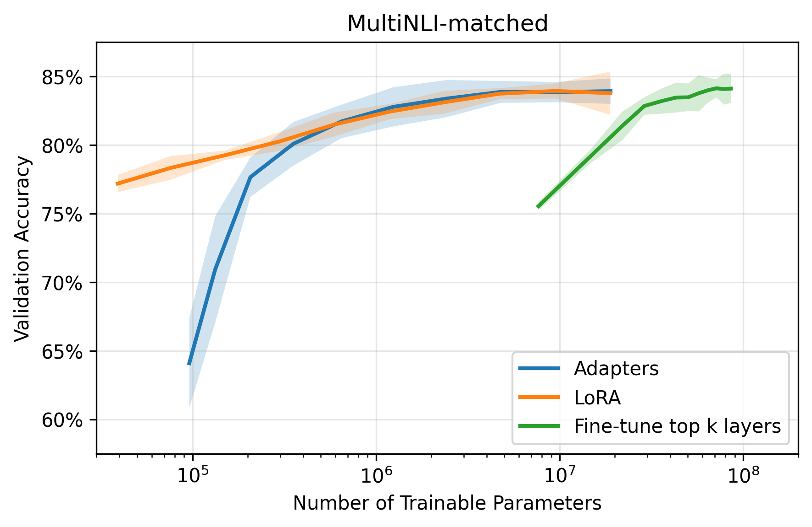

# PEFT
This repository contains my personal implementation of common **Parameter Efficient Fine-Tuning (PEFT)** methods using the Hugging Face Transformers library. The project covers adaptation of pre-trained BERT models on GLUE tasks using adapters and low-rank adaptation (LoRA), and evaluation against traditionally fine-tuned models.

## 🌟 Introduction

In natural language processing (NLP), **transfer learning** typically follows one of two paradigms:
1. **Fine-tuning:** A pre-trained model $\phi_{\mathbf{w}}$ is adapted to a new task by updating its parameters $\mathbf{w}$ on task-specific data, often with an added task-specific output head. This approach modifies most or all of the original parameters.
2. **Feature-based transfer:** The pre-trained model $\phi_{\mathbf{w}}$ is treated as a fixed feature extractor. Its parameters $\mathbf{w}$ remain frozen, and the representations it produces are fed into a separate task-specific model $\chi_{\mathbf{v}}$. Only the task-specific parameters $\mathbf{v}$ are trained, yielding the composed function $\chi_{\mathbf{v}}(\phi_{\mathbf{w}}(\mathbf{x}))$.

While both approaches have demonstrated strong performance, they suffer from **parameter inefficiency**: achieving competitive results on each new task requires training or storing a large number of parameters. As the number of tasks scales, this becomes computationally and memory prohibitive.

**Parameter-Efficient Fine-Tuning (PEFT)** addresses this limitation by updating only a small subset of parameters or introducing a lightweight set of trainable components while keeping the majority of the pre-trained model fixed. This approach significantly reduces memory and computational requirements without substantially sacrificing task performance.

In that context, the goal of this project is to demonstrate the effectiveness of different PEFT methods through a systematic evaluation on the **GLUE benchmark**, comparing their task performance and parameter efficiency relative to full fine-tuning:
- [Adapters](https://arxiv.org/abs/1902.00751)
- [Low-Rank Adaptation](https://arxiv.org/abs/2106.09685)
- Prefix Tuning *(coming soon)*
- Prompt Tuning *(coming soon)*
- BitFit *(coming soon)*

## 🏗️ Methods

This implementation uses the **BERT Base encoder** (Devlin et al., 2019), a bidirectional Transformer pre-trained on masked language modeling and next-sentence predicition. BERT provides a strong general-purpose language representation, which can be efficiently adapted to downstream NLP tasks through fine-tuning. 

To evaluate different adaptation strategies, all models are trained and tested on the **GLUE benchmark** (Wang et al., 2019), a collection of diverse sentence- and sentence-pair **classification tasks** designed to assess general language understanding and transfer ability. For each task, the final hidden state corresponding to the special `[CLS]` token is used as the aggregate representation of the input, which is then passed to a task-specific classification head.

While full-parameter fine-tuning serves as the baseline, it scales poorly with the number of tasks due to its high parameter and storage costs. This work therefore explores a variety of parameter-efficient approaches, explained in detail below.

### Adapters

The core idea behing adapter-based fine-tuning (Houlsby et al., 2019) is to **insert small, trainable modules** (referred to as *adapters*) between the layers of a large pre-trained network such as BERT. Formally, adapter-based fine-tuning defines a new function:
```math
\psi_{\mathbf{w},\mathbf{v}}(\mathbf{x}) = \mathrm{Adapter}_\mathbf{v}(\phi_\mathbf{w}(\mathbf{x}))
```
where:
- $\mathbf{w}$ are the original pre-trained parameters, kept *frozen* during training
- $\mathbf{v}$ are newly introduced adapter parameters, initiliazed so that $\psi_{\mathbf{w},\mathbf{v}}(\mathbf{x}) \approx \phi_\mathbf{w}(\mathbf{x})$ at the start of training

Only $\mathbf{v}$ are updated, while $\mathbf{w}$ remain fixed. This approach confers two key properties:
- **Compactness:** If $\lvert\mathbf{v}\rvert \ll \lvert\mathbf{w}\rvert$, then the total number of trainable parameters per task is small. This allows storing many task-specific models with only a marginal increase over the base model’s size.
- **Extensibility:** Because $\mathbf{w}$ are fixed, new adapters can be trained for additional tasks without affecting previously learned ones. The system can thus grow to accommodate new tasks *without retraining or interfering* with existing knowledge.

Adapter modules are inserted into the Transformer architecture immediately after the attention and feedforward sublayers  before their residual connections. A **bottleneck architecture** is used to limit the number of parameters. The adapters *project* the original $d$-dimensional features into a smaller dimension $m$, apply a *non-linearity*, then project back to $d$ dimensions. An *internal residual connection* is implemented such that if the parameters of the projection layers are initialized to near-zero, the adapter itself is initialized to an approximate *identity function*—effectively allowing you to "disable" the adapter. Formally, an adapter module can be described as follows:
```math
\textrm{Adapter}(\mathbf{h}) = \mathbf{h} + \mathbf{W}_\mathrm{up}\sigma(\mathbf{W}_\mathrm{down}\mathbf{h})
```
where:
- $\mathbf{h}\in\mathbb{R}^d$ denotes the hidden representation of any token at a given layer of the Transformer
- $\mathbf{W}_\mathrm{down}\in\mathbb{R}^{m\times d}$ denotes the parameters of the linear down-projection layer
- $\mathbf{W}_\mathrm{up}\in\mathbb{R}^{d\times m}$ denotes the parameters of the linear up-projection layer
- $\sigma(\cdot)$ denotes the non-linearity (e.g. ReLU)

### Low-Rank Adaptation

Low-Rank Adaptation (Hu et al., 2022) fine-tunes large pre-trained models by constraining weight updates to a **low-dimensional subspace**, rather than directly updating all parameters. The key insight is that parameter updates in **over-parameterized models** often lie in a space of intrinsically **low rank**. Instead of modifying the full weight matrices, LoRA **introduces pairs of small trainable matrices that approximate these updates**, while keeping the original pretrained weights fixed.

Formally, for a frozen weight matrix $W_0 \in \mathbb{R}^{d \times k}$, LoRA parameterizes its update as:
```math
W_0 + \Delta W = W_0 + BA
```
where:
- $A \in \mathbb{R}^{r \times k}$ and $B \in \mathbb{R}^{d \times r}$ are trainable matrices
- $r \ll \min(d, k)$ is the rank hyperparameter controlling the adaptation’s dimensionality.

During fine-tuning, only $A$ and $B$ are optimized, while $W_0$ remains frozen. The modified forward pass for a dense layer with input $\mathbf{x}$ is given by:
```math
h = W_0x + \frac{\alpha}{r} \Delta Wx = W_0x + \frac{\alpha}{r} BAx
```
Here, $\alpha$ is a scaling factor introduced to reduce sensitivity to hyperparameter tuning across different ranks $r$. The matrix $A$ is initialized with a zero-mean Gaussian distribution, while $B$ is initialized to zero, ensuring that the initial update $\Delta W = BA = 0$.

This formulation offers two key properties:
- **A continuum between LoRA and full fine-tuning:** As $r$ increases toward the full rank of $W_0$, LoRA’s behavior approximates full fine-tuning.  
- **Latency-free deployment:** During inference, the effective weight $W = W_0 + BA$ can be precomputed and cached. When switching tasks, $W_0$ remains constant—only the low-rank adapters $(A, B)$ need to be swapped, incurring minimal memory and computation overhead.

LoRA can, in principle, be applied to any dense layer within a neural architecture. In Transformer-based models, this includes the projection matrices of the self-attention module ($W_q$, $W_k$, $W_v$, and $W_o$) as well as the two feed-forward (MLP) layers. 

## 🔍 Implementation Details

- The GLUE dataset was downloaded using the 🤗 `datasets` library from [https://huggingface.co/datasets/nyu-mll/glue](https://huggingface.co/datasets/nyu-mll/glue)
- Inputs were prepared with `BertTokenizer.from_pretrained(checkpoint)` using truncation and attention-based masking
- Batching was performed using `DataCollatorWithPadding` for dynamic padding to avoid wasted compute on padding tokens
- The Adam optimizer and a linear decay learning rate scheduler with warm-up were used across all fine-tuning methods
- Distributed training was achieved using the 🤗 `accelerate` library
- Training and experiments were deployed in a system with 4xA100 Nvidia GPUs
- `tensorboard` was used to log and monitor training progress
- Modules for adapters and LoRA were written from scratch

## ⚙️ Installation

**1. Clone the repository**

```bash
git clone https://github.com/rplacucci/PEFT.git
cd PEFT
```

**2. Setup the local environment**

```bash
python -m venv .venv
source .venv/bin/activate
```

**3. Install dependencies**

```bash
pip install -r requirements.txt
```

## 🚀 Usage

Usage of this repository is divided into three steps: fine-tuning with different methods, evaluation on the GLUE benchmark, and experiments on how performance on a given task is affected by the fine-tuned parameter count. In the following code, change `{peft_method}` to:
- `baseline` for full-parameter fine-tuning
- `adapters` for fine-tuning wih adapters
- `lora` for fine-tuning with low-rank adaptation

See **Key options** for a description of required user inputs.

### 1. Fine-tuning

Fine-tune the pre-trained model on a GLUE task:
```bash
accelerate launch -m {peft_method}.tune
```

Alternatively, fine-tune the pre-trained model across the entire GLUE benchmark:
```bash
chmod +x ./{peft_method}/run_tune.sh
./{peft_method}/run_tune.sh
```

### 2. Evaluation

Evaluate the fine-tuned model on a GLUE task:
```bash
accelerate launch -m {peft_method}.test
```

Alternatively, evaluate the fine-tuned model across the entire GLUE benchmark
```bash
chmod +x ./{peft_method}/run_test.sh
./{peft_method}/run_test.sh
```

### 3. Experiments

Investigate how performance on a GLUE task varies with the fine-tuned parameter count:
```bash
chmod +x ./{peft_method}/run_experiment.sh
./{peft_method}/run_experiment.sh
```

### Key options

Adjust the following required inputs according to your goals and computational resources. See code for other available user inputs.

**Global**
- `--checkpoint`: configuration of the pre-trained BERT model
- `--task_name`: name of the GLUE task
- `--lr`: maximum learning rate for the optimizer
- `--batch_size`: number of samples per training or validation step
- `--n_epochs`: number of passes through the dataset during training
- `--seed`: random seeds for reproducibility

**Full-parameter fine-tuning**
- `--top_k`: Top-k layers to fine-tune on

**Adapter-based fine-tuning**
- `--bottleneck_size`: size of the adapter bottleneck dimension

**LoRA-based fine-tuning**
- `--rank`: dimension of rank decomposition matrices
- `--alpha`: scaling hyperparameter

## 📊 Results

The following table summarizes the GLUE scores on the test set across different fine-tuning methods (best scores in bold). Consistent with Houlsby et al. (2019) and Hu et al. (2022), Adapters achieve slightly higher overall performance than full fine-tuning while training fewer than 10% of parameters, whereas LoRA attains nearly comparable results with under 1% of trainable weights. These findings confirm that parameter-efficient fine-tuning can match or surpass full-model adaptation on GLUE while dramatically reducing computational cost.

| **Task** | **Metric**            | **Full-Parameter** | **Adapters**      | **Low-Rank**   |
| -------- | --------------------- | :----------------: | :---------------: | :------------: |
| CoLA     | Matthew's corr        | 49.1               | **53.0**          | 52.0           |
| SST-2    | Accuracy              | **93.9**           | 93.4              | 92.0           |
| MRPC     | F1/Accuracy           | 88.0/83.5          | **89.7**/**85.7** | 88.5/84.4      |
| STS-B    | Pearson/Spearman corr | 84.0/82.5          | **87.0**/**85.7** | 85.5/84.3      |
| QQP      | F1/Accuracy           | **71.6**/**89.3**  | 70.8/88.7         | 71.0/89.1      |
| MNLI-m   | Accuracy              | **84.3**           | 83.8              | 83.3           |
| MNLI-mm  | Accuracy              | **83.9**           | 82.7              | 82.3           |
| QNLI     | Accuracy              | **91.0**           | 90.7              | 90.4           |
| RTE      | Accuracy              | 63.5               | 68.2              | **69.0**       |
| WNLI     | Accuracy              | 56.2               | **65.1**          | **65.1**       |
| AX       | Matthew's corr        | **36.7**           | 34.5              | 33.8           |
| Score    | ---                   | 76.3               | **78.6**          | 78.1           |
| **Trainable Parameters** | ---   | 100%               | 2.21-8.68%        | **0.14-0.54%** |

**Note:** The best hyperparameters were selected from the lists below for every combination of task and PEFT method for the final evaluation run:
 
| Fine-tuning Method | Batch Size | Learning Rate          | Epochs   | Bottleneck Size | Rank  | Alpha         |
|--------------------|------------|------------------------|----------|-----------------|-------|---------------|
| **Full-Parameter** | 16, 32     | 1e-5, 2e-5, 3e-5, 5e-5 | 2, 3, 4  | ---             | ---   | ---           |
| **Adapters**       | 32         | 1e-4, 1e-3             | 3, 20    | 64, 256         | ---   | ---           |
| **Low-Rank**       | 32         | 1e-4, 5e-4             | 3, 20    | ---             | 4, 16 | Equal to rank |

The following figure shows how validation accuracy ($\pm 3\sigma$) on MultiNLI (matched) varies as a function of the number of trainable parameters for different fine-tuning methods. Increasing the adapter bottleneck dimension (or equivalently the LoRA rank) monotonically improves performance until convergence near full fine-tuning levels, consistent with observations from Houlsby et al. (2019) and Hu et al. (2022). **Both Adapters and LoRA achieve strong performance with orders of magnitude fewer trainable parameters**, while fine-tuning the top-k encoder layers requires substantially more parameters to reach similar accuracy. This illustrates that PEFT methods scale more efficiently with parameter count, capturing most of the task-specific information through compact low-rank or modular updates.



**Note:** all experiments were conducted with the BERT base configuration.

## 🔮 Future Work

- Add experiments for Prefix Tuning, Prompt Tuning, and BitFit
- Train and evaluate other BERT configurations and other models
- Extend experiments of performance versus parameters to other tasks
- Compare from-scratch implementations of the PEFT methods with official 🤗 implementations

## 📚 References

- Devlin, J., Chang, M.-W., Lee, K., & Toutanova, K. (2019). *BERT: Pre-training of Deep Bidirectional Transformers for Language Understanding.*
- Wang, A., Singh, A., Michael, J., Hill, F., Levy, O., & Bowman, S. R. (2019). *GLUE: A Multi‑Task Benchmark and Analysis Platform for Natural Language Understanding.*
- Houlsby, N., Giurgiu, A., Jastrzȩbski, S., Morrone, B., de Laroussilhe, Q., Gesmundo, A., Attariyan, M., & Gelly, S. (2019). *Parameter-Efficient Transfer Learning for NLP.*
- Hu, E. J., Shen, Y., Wallis, P., Allen-Zhu, Z., Li, Y., Wang, S., Wang, L., & Chen, W. (2021). *LoRA: Low-Rank Adaptation of Large Language Models.*
